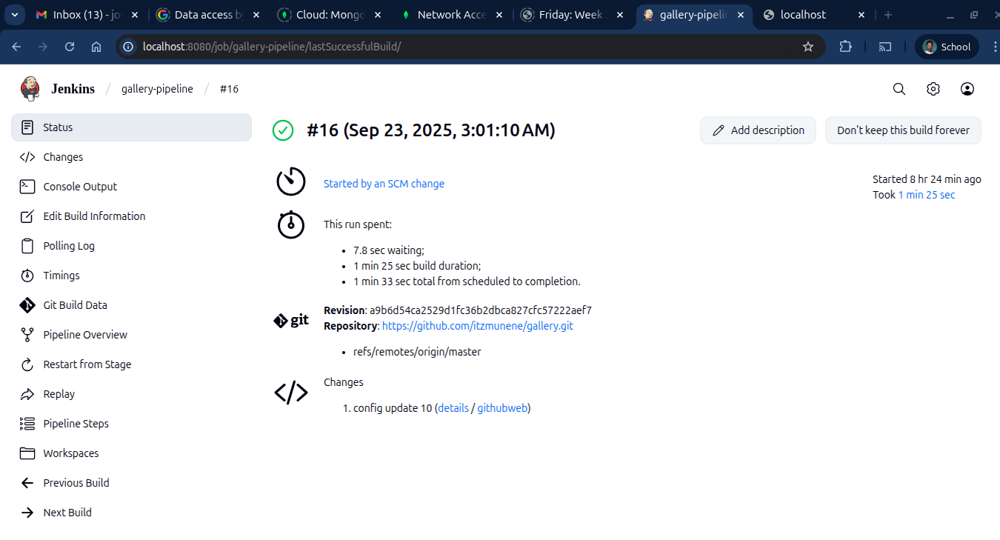

# 🌌 Darkroom Cloud Application

This project is a **cloud-deployed photo gallery** built with  
**Node.js**, **Express**, **MongoDB**, and **EJS**.  
It supports cloud deployment pipelines, testing, and CI/CD integrations with **Jenkins**, **Render**, and **Slack**.

---

## 🚀 Milestone 1: Set Up
- Forked and cloned the starter repo.  
- Configured **MongoDB Atlas cluster** and created a database user.  
- Updated `_config.js` with the Atlas URI (`mongodb+srv://...`) replacing `<USERNAME>` and `<PASSWORD>`.
- Confirmed successful connection from `server.js` to Atlas.  
- 🔒 *Next step:* Secure credentials using environment variables or secret files (avoid committing to `_config.js`).  

---

## 🔧 Milestone 2: Basic Pipeline
- Created a `Jenkinsfile` for automated CI/CD.  
- Pipeline installs dependencies (`npm install`), builds, and deploys to **Render**.  
- Configured **auto-trigger** on push events.  
- Updated landing page with “MILESTONE 2” text, deployed live.  

## 🧪 Milestone 3: Tests
- Discovered tests on the `test` branch → merged into `main`.  
- Updated `Jenkinsfile` to run `npm test` before deploying.  
- Configured **Jenkins email notifications** if tests fail.  
- Updated landing page to display:  
  - “MILESTONE 2”  
  - “MILESTONE 3”  

---

## 💬 Milestone 4: Slack Integration
- Created a Slack channel.  
- Attempted Jenkins → Slack integration.  
- ⚠ Still debugging: reverted Slack stage in pipeline for now.  
- Future goal: Notifications with build ID + Render link.  

## 🔧 Recent Fixes
- **MongoDB Authentication Issue** → updated Atlas URI to encode password (`@ → %40`).  
- **Config Debugging** → ensured `process.env.NODE_ENV` is set correctly on Render, added logging in `server.js`.  
- **Deployment** → automated via Jenkins pipeline.  

---

## 🌍 Deployment
✅ On successful build, app is deployed to **Render**:

🔗 [Live Render App](https://gallery-j9wd.onrender.com/)

